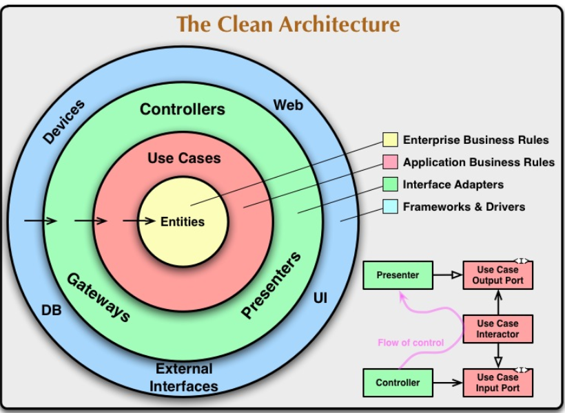

# Clean-Architecture-Example-in-Python-Flask

## Running:
export PORT=5000  
python3 app.py  

## Running on docker-compose:
docker-compose up

## Entities:

- User
- Post
- Comment

## Example Requests

GET http://0.0.0.0:5000/users  
GET http://0.0.0.0:5000/user/2  
GET http://0.0.0.0:5000/post/2  
GET http://0.0.0.0:5000/post-comments/2  

## Image

